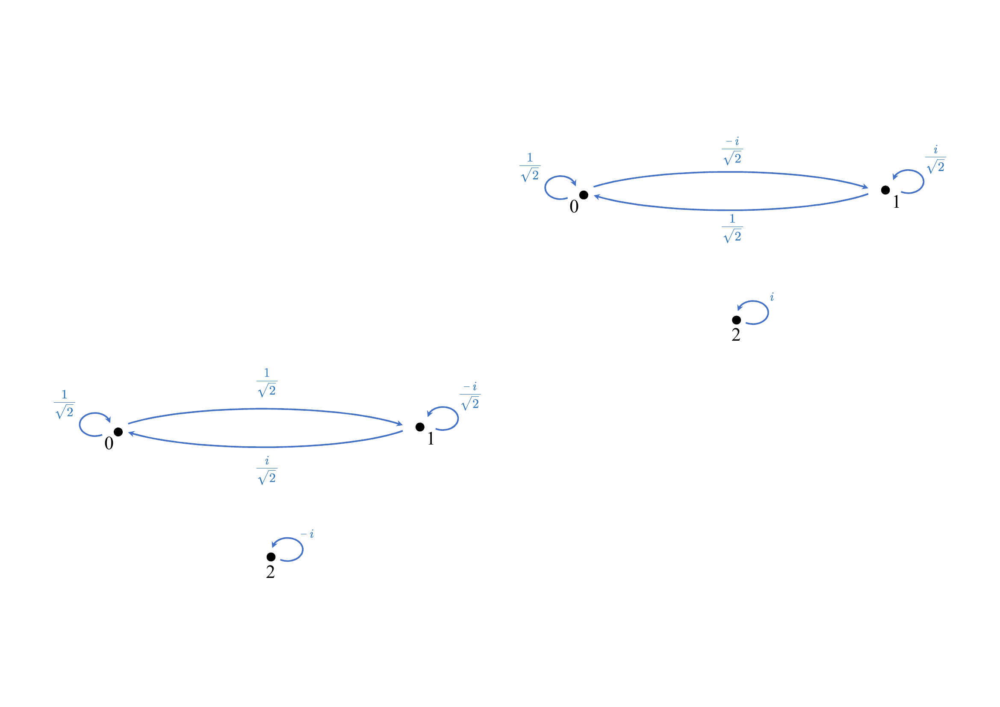

# The Leap from Classic to Quantum

## Classic Deterministic Systems

:::note[definition]
If $f:\mathbb{R}^n\rightarrow\mathbb{R}^n$ is a transformation and
$\cdots, \boldsymbol{x}_t, \boldsymbol{x}_{t+1}, \boldsymbol{x}_{t+2}, \cdots$
is a sequence of vectors in $\mathbb{R}^n$ such that
$\boldsymbol{x}_{t+1}=f(\boldsymbol{x}_{t})$, then we say that $f$ and
sequence
$\cdots, \boldsymbol{x}_t, \boldsymbol{x}_{t+1}, \boldsymbol{x}_{t+2}, \cdots$
make up a discrete dynamical system, where function $f$ is called
dynamics and vectors $\{\boldsymbol{x}_t\}$ are called states.
:::

<figcaption style= {{textAlign: 'center', fontFamily: 'Calibri'}}>Figure 1.1: Classic billiards </figcaption>

:::info[example:classic-billiards]
Let's consider a simple system described by a
**simple (unweighted) directed graph** together with some toy marbles.
There be $6$ vertices in a graph and a total of $27$ marbles. We might
place $6$ marbles on vertex $0$, $2$ marbles on vertex $1$, and the rest
as described by Figure
[1.1](#fig:classic-billiards).

We shall denote its **deterministic state** as
$\boldsymbol{x}=[6,2,1,5,3,10]^{\top}$, and its **dynamics** as a
**Boolean adjacency matrix** $\mathbf{M}=
    \begin{bmatrix}
        0 & 0 & 0 & 0 & 0 & 0 \\
        0 & 0 & 0 & 0 & 0 & 0 \\
        0 & 1 & 0 & 0 & 0 & 1 \\
        0 & 0 & 0 & 1 & 0 & 0 \\
        0 & 0 & 1 & 0 & 0 & 0 \\
        1 & 0 & 0 & 0 & 1 & 0       
    \end{bmatrix}$ where $\mathbf{M}(i,j)=1$ if and only if there is an
arrow from vertex $j$ to vertex $i$.
:::

The **state evolvement** can be represented as matrix multiplication:
$$\boldsymbol{x}_{t+1}=f(\boldsymbol{x}_{i})=\mathbf{M}\boldsymbol{x}_{t}$$

The multiple step dynamics can be written as Boolean matrix
multiplication:
$$\mathbf{M}^2(i,j)=\bigvee_{k=0}^{n-1}\mathbf{M}(i,k)\wedge\mathbf{M}(k,j)$$
where $\vee$ and $\wedge$ represent Boolean "OR" and "AND" operators,
and $\mathbf{M}^2(i,j)=1$ if and only if there is a path of length 2
from vertex $j$ to vertex $i$ as shown in Figure
[1.2](#fig:multiple-step-dynamics).

<figcaption style= {{textAlign: 'center', fontFamily: 'Calibri'}}>Figure 1.2: multiple step dynamics </figcaption>

## Probabilistic Systems

The **state** of a probabilistic system is composed of probabilistic
entries, and the sum of all entries is $1$.

:::info[example: probabilistic system]
$$\boldsymbol{x}=\left[\frac{1}{5}, \frac{3}{10}, \frac{1}{2}\right]^{\top}\nonumber$$

-   one-fifth chance that the marble is on vertex 0;

-   three-tenths chance that the marble is on vertex 1;

-   half chance that the marble is on vertex 2.
:::

The **dynamics** of a probabilistic system is described by a directed
(probabilistic) weighted graph, where several arrows shooting out of
each vertex with real numbers between 0 and 1 as weights as shown in
Figure [1.3](#fig:probabilistic-system). The corresponding matrix is
called **doubly stochastic matrix**, which has the following two
properties:

-   The column sum, *i.e.*, the sum of all weights leaving a vertex, is $1$;

-   The row sum, *i.e.*, the sum of all weights entering a vertex, is $1$.

<figcaption style= {{textAlign: 'center', fontFamily: 'Calibri'}}>Figure 1.3: probabilistic system </figcaption>

The **state evolvement.** If we have $\boldsymbol{x}_t$ expressing the
probability of the position of the marble at time $t$ and $\mathbf{M}$
expressing the probability of the way the marble moves around, then
$\boldsymbol{x}_{t+1}=\mathbf{M}\boldsymbol{x}_t$ is expressing the
probability of the marble's location at time $t + 1$.

The **multiple step dynamics** of probabilistic system is formulated
with matrix multiplication with probability entries (*a.k.a.*, normal
matrix multiplication). Figure
[1.4](#fig:weighted-multiple-step-dynamics) shows an example of the
2-step dynamics.

<figcaption style= {{textAlign: 'center', fontFamily: 'Calibri'}}>Figure 1.4:The 2-step dynamics in the probabilistic system </figcaption>

<figcaption style= {{textAlign: 'center', fontFamily: 'Calibri'}}>Figure 1.5: stochastic-billiard </figcaption>

:::info[example: stochastic-billiard]
Consider a stochastic billiard with dynamics
shown in Figure [1.5](#fig:stochastic-billiard) and initial state
$\boldsymbol{x}_{0}$, its state evolvement procedure exhibits periodic
cycles as follows: 
$$          \begin{aligned}\boldsymbol{x}_{0}=\begin{bmatrix}1 & 0 & 0 & 0\end{bmatrix}^{\top}&\stackrel{\mathbf{M}}{\longmapsto}{\color{red}\boldsymbol{x}_{1}}=\begin{bmatrix}0 & \frac{1}{2} & \frac{1}{2} & 0\end{bmatrix}^{\top}\stackrel{\mathbf{M}}{\longmapsto}{\color{blue}\boldsymbol{x}_{2}}=\begin{bmatrix}\frac{1}{2} & 0 & 0 & \frac{1}{2}\end{bmatrix}^{\top}\\&\stackrel{\mathbf{M}}{\longmapsto}\boldsymbol{x}_{3}={\color{red}\boldsymbol{x}_{1}}\stackrel{\mathbf{M}}{\longmapsto}\boldsymbol{x}_{4}={\color{blue}\boldsymbol{x}_{2}}\stackrel{\mathbf{M}}{\longmapsto}\cdots\end{aligned}$$
:::

<figcaption style= {{textAlign: 'center', fontFamily: 'Calibri'}}>Figure 1.6: probabilistic-double-silt</figcaption>

:::info[example:probabilistic-double-silt]
Assume a virtual double silt experiment as shown in Figure
[1.6](#fig:probabilistic-double-silt). The bullets are fired from
the machine-gun, pass through two narrow slits in the wall, and
eventually land on the targets behind the wall. Its dynamics matrix can
be formulated as $$\mathbf{M}=\begin{bmatrix} 0 & 0 & 0 & 0 & 0 & 0 & 0 & 0\\[4pt]\frac{1}{2} & 0 & 0 & 0 & 0 & 0 & 0 & 0\\[4pt]\frac{1}{2} & 0 & 0 & 0 & 0 & 0 & 0 & 0\\[4pt]0 & \frac{1}{3} & 0 & 0 & 0 & 0 & 0 & 0\\[4pt]0 & \frac{1}{3} & 0 & 0 & 0 & 0 & 0 & 0\\[4pt]0 & \frac{1}{3} & \frac{1}{3} & 0 & 0 & 0 & 0 & 0\\[4pt]0 & 0 & \frac{1}{3} & 0 & 0 & 0 & 0 & 0\\[4pt]0 & 0 & \frac{1}{3} & 0 & 0 & 0 & 0 & 0\\[4pt]\end{bmatrix}\nonumber$$ and accordingly, its $2$-step dynamics
can be computed by matrix multiplication:
$$\mathbf{M}^2=\mathbf{M}\times \mathbf{M}=\begin{bmatrix}0 & 0 & 0 & 0 & 0 & 0 & 0 & 0\\[4pt]0 & 0 & 0 & 0 & 0 & 0 & 0 & 0\\[4pt]0 & 0 & 0 & 0 & 0 & 0 & 0 & 0\\[4pt]\frac{1}{6} & \frac{1}{3} & 0 & 1 & 0 & 0 & 0 & 0\\[4pt]\frac{1}{6} & \frac{1}{3} & 0 & 0 & 1 & 0 & 0 & 0\\[4pt]\color{red}\frac{1}{3} & \frac{1}{3} & 0 & 0 & 1 & 0 & 0\\[4pt]\frac{1}{6} & 0 & \frac{1}{3} & 0 & 0 & 0 & 1 & 0\\[4pt]\frac{1}{6} & 0 & \frac{1}{3} & 0 & 0 & 0 & 0 & 1\\[4pt]\end{bmatrix}\nonumber$$ Hence, given an initial state
$\boldsymbol{x}_0=\begin{bmatrix}
        1 & 0 & 0 & 0 & 0 & 0 & 0 & 0
    \end{bmatrix}^{\top}$, its $2$-step transition state
$\boldsymbol{x}_2=\mathbf{M}^2\boldsymbol{x}_0=\begin{bmatrix}
        0 & 0 & 0 & \frac{1}{6} & \frac{1}{6} & \color{red}\frac{1}{3} & \frac{1}{6} & \frac{1}{6}
    \end{bmatrix}^{\top}$.

Note that the probability of the bullets landing on the middle target is
the largest, *i.e.*, $\color{red}\frac{1}{3}$. This is consistent with
our knowledge because both routes can reach this target, meaning a
summation of probabilities.
:::

## Quantum Systems

The **state** of a quantum system is composed of quantum entries
(complex values), whose modulus square represents the probability, and
the sum of modulus squared of all entries is $1$.

:::info[example:quantum-state]
Consider a complex vector $\boldsymbol{x}=\left[\frac{1}{\sqrt{3}}, \frac{2i}{\sqrt{15}}, \sqrt{\frac{2}{5}}\right]^{\top}$,
since
$\boldsymbol{x}^{\dagger}\boldsymbol{x}=\frac{1}{3}+\frac{4}{15}+\frac{2}{5}=1$,
it is a qualified state vector of a quantum system.
:::

The **dynamics** of a quantum system also has two representations. One
is the graph form, which can be described by a directed (complex)
weighted graph. The other is the matrix form, which corresponds to a
special unitary matrix whose modulus square is a doubly stochastic
matrix as exemplified in Figure
[1.7](#fig:quantum-system).

<figcaption style= {{textAlign: 'center', fontFamily: 'Calibri'}}>Figure 1.7: quantum-system</figcaption>

Table below gives a detailed comparison of three
systems in terms their states and dynamics. In particular, the dynamics
is represented in two different forms, which are graph (Gra.) and matrix
(Mat.), respectively.

|                     | Classic Deterministic System                                | Probabilistic System                                         | Quantum System                                               |
| ------------------- | ----------------------------------------------------------- | ------------------------------------------------------------ | ------------------------------------------------------------ |
| **State**           | $\boldsymbol{x}=[x_1, x_2, x_3]^{\top}$, $x_i\in\mathbb{N}$ | $\boldsymbol{x}=[p_1, p_2, p_3]^{\top}$, $x_i\in[0,1], \sum_i p_i=1$ | $\boldsymbol{x}=[c_1, c_2, c_3]^{\top}$,$c_i\in\mathbb{C}, \sum_i $ |
| **Dynamics (Gra.)** | Directed unweighted graph                                   | Directed (probabilistic) weighted graph                      | Directed (complex) weighted graph                            |
| **Dynamics (Mat.)** | Boolean adjacency matrix                                    | Doubly stochastic matrix                                     | Unitary matrix whose modulus squares is a doubly stochastic matrix |

The **state evolvement** is formulated as matrix multiplication
$\boldsymbol{x}_{t+1}=\mathbf{M}\boldsymbol{x}_{t}$.

The **forward dynamics** and **backward dynamics** can be represented as
a matrix $\mathbf{M}$ and its adjoint $\mathbf{M}^{\dagger}$ as shown in the following
Table. This means that if you perform some
operation $\boldsymbol{x}\mapsto\mathbf{M}\boldsymbol{x}$ and then
"undo" the operation
$\mathbf{M}^{\dagger}\mathbf{M}\boldsymbol{x}=\mathbf{I}\boldsymbol{x}=\boldsymbol{x}$,
you will find yourself (with probability 1) in the same state with which
you began.

|                       | Dynamics graph | Dynamics Matrix                                              |
| --------------------- | -------------- | ------------------------------------------------------------ |
| **Forward dynamics**  |                | $\mathbf{M}=\begin{bmatrix}\frac{1}{\sqrt{2}} & \frac{1}{\sqrt{2}} & 0\\[8pt]\frac{-i}{\sqrt{2}} & \frac{i}{\sqrt{2}} & 0\\[8pt]0 & 0 & i\\[4pt]\end{bmatrix}$ |
| **Backward dynamics** |                | $\mathbf{M}=\begin{bmatrix}\frac{1}{\sqrt{2}} & \frac{i}{\sqrt{2}} & 0\\[8pt]\frac{1}{\sqrt{2}} & \frac{-i}{\sqrt{2}} & 0\\[8pt]0 & 0 & -i\\[4pt]\end{bmatrix}$ |

<figcaption style= {{textAlign: 'center', fontFamily: 'Calibri'}}>Figure 1.8: quantum billiard </figcaption>

:::note[example]
Consider a quantum billiard with dynamics shown in
Figure [1.8](#fig:quantum-billiard) and initial state
$\boldsymbol{x}_{0}$, its state evolvement procedure exhibits periodic
cycles as follows: $$\begin{aligned}\boldsymbol{x}_{0}=\begin{bmatrix}1 & 0 & 0 & 0\end{bmatrix}^{\top}&\stackrel{\mathbf{M}}{\longmapsto}{\color{black}\boldsymbol{x}_{1}}=\begin{bmatrix}0 & \frac{1}{\sqrt{2}} & \frac{1}{\sqrt{2}} & 0\end{bmatrix}^{\top}\\&\stackrel{\mathbf{M}}{\longmapsto}{\color{black}\boldsymbol{x}_{2}}={\color{red}\boldsymbol{x}_{0}}\stackrel{\mathbf{M}}{\longmapsto}\boldsymbol{x}_{3}={\color{blue}\boldsymbol{x}_{1}}\stackrel{\mathbf{M}}{\longmapsto}\cdots\end{aligned}$$
:::

<figcaption style= {{textAlign: 'center', fontFamily: 'Calibri'}}>Figure 1.9: Double slit experiment </figcaption>

:::note[example]
Given a double silt experiment as shown in Figure
[1.9](#fig:double-silt). The photons are ejected from the
flashlight, pass through two narrow slits in the wall, and eventually
land on the screens behind the wall. Its 1-step and 2-step dynamics
matrices are respectively $$\mathbf{M}=\begin{bmatrix}
            0 & 0 & 0 & 0 & 0 & 0 & 0 & 0\\[8pt]
            \frac{1}{\sqrt{2}} & 0 & 0 & 0 & 0 & 0 & 0 & 0\\[8pt]
            \frac{1}{\sqrt{2}} & 0 & 0 & 0 & 0 & 0 & 0 & 0\\[8pt]
            0 & \frac{-1+i}{\sqrt{6}} & 0 & 1 & 0 & 0 & 0 & 0\\[8pt]
            0 & \frac{-1-i}{\sqrt{6}} & 0 & 0 & 1 & 0 & 0 & 0\\[8pt]
            0 & \frac{1-i}{\sqrt{6}} & \frac{-1+i}{\sqrt{6}} & 0 & 0 & 1 & 0 & 0\\[8pt]
            0 & 0 & \frac{-1-i}{\sqrt{6}} & 0 & 0 & 0 & 1 & 0\\[8pt]
            0 & 0 & \frac{1-i}{\sqrt{6}} & 0 & 0 & 0 & 0 & 1\\[8pt]
        \end{bmatrix}\nonumber\mapsto
        \mathbf{M}^2=\begin{bmatrix}
            0 & 0 & 0 & 0 & 0 & 0 & 0 & 0\\[8pt]
            0 & 0 & 0 & 0 & 0 & 0 & 0 & 0\\[8pt]
            0 & 0 & 0 & 0 & 0 & 0 & 0 & 0\\[8pt]
            \frac{-1+i}{\sqrt{12}} & \frac{-1+i}{\sqrt{6}} & 0 & 1 & 0 & 0 & 0 & 0\\[8pt]
            \frac{-1-i}{\sqrt{12}} & \frac{-1-i}{\sqrt{6}} & 0 & 0 & 1 & 0 & 0 & 0\\[8pt]
            \color{red}{0} & \frac{1-i}{\sqrt{6}} & \frac{-1+i}{\sqrt{6}} & 0 & 0 & 1 & 0 & 0\\[8pt]
            \frac{-1-i}{\sqrt{12}} & 0 & \frac{-1-i}{\sqrt{6}} & 0 & 0 & 0 & 1 & 0\\[8pt]
            \frac{-1+i}{\sqrt{12}} & 0 & \frac{1-i}{\sqrt{6}} & 0 & 0 & 0 & 0 & 1\\[8pt]
        \end{bmatrix}\nonumber$$ Note that
$\mathbf{M}(5,0)=\frac{1}{\sqrt{2}}(\frac{1-i}{\sqrt{6}})+\frac{1}{\sqrt{2}}(\frac{-1+i}{\sqrt{6}})=\frac{1-i}{\sqrt{12}}+\frac{-1+i}{\sqrt{12}}=\frac{0}{\sqrt{12}}=\color{red}{0}$,
which is called **interference** phenomenon.
:::

**Superposition**. Let the state of the system be given by
$\boldsymbol{x}= [c_0, c_1, \cdots ,c_{n−1}]^{\top}\in\mathbb{C}^n$. It
is incorrect to say that the probability of the photon's being in
position $k$ is $|c_k|^2$. Rather, to be in state $\boldsymbol{x}$ means
that the particle is in some sense in *all* positions simultaneously.
The photon passes through the top slit and the bottom slit
simultaneously, and when it exits both slits, it can cancel itself out.
A photon is not in a single position, rather it is in many positions, a
superposition.

**Measurement and collapse**. The reason we see particles in one
particular position is because we have performed a measurement. When we
measure something at the quantum level, the quantum object that we have
measured is no longer in a superposition of states, rather it collapses
to a single classical state. So we have to redefine what the state of a
quantum system is: a system is in state $\boldsymbol{x}$ means that
*after measuring* it, it will be found in position $i$ with probability
$|c_i|^2$.

**Power of quantum computing.** It is exactly this superposition of
states that is the real power behind quantum computing. Classical
computers are in one state at every moment. Imagine putting a computer
in many different classical states simultaneously and then processing
with all the states at once. This is the ultimate in parallel
processing!
